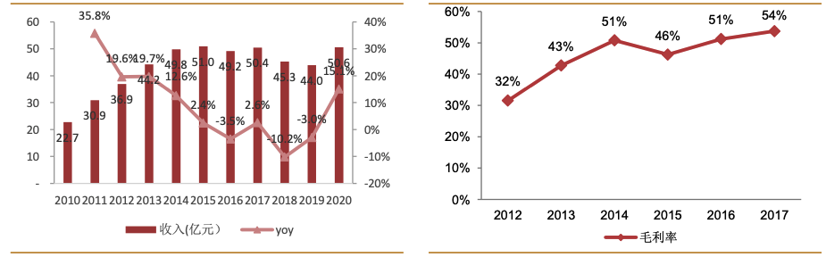
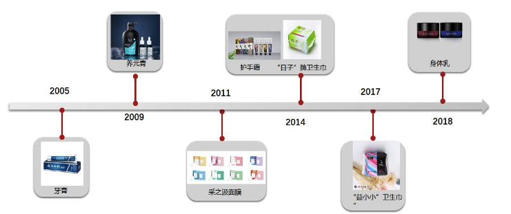
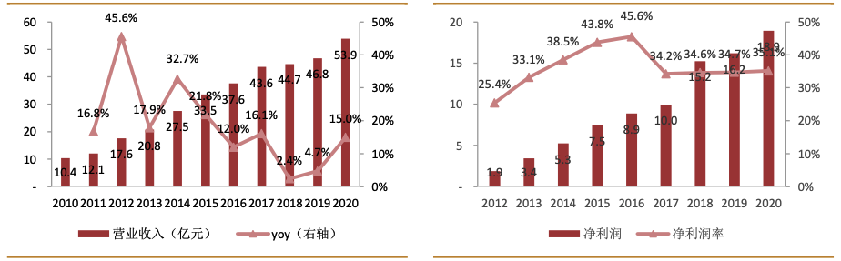
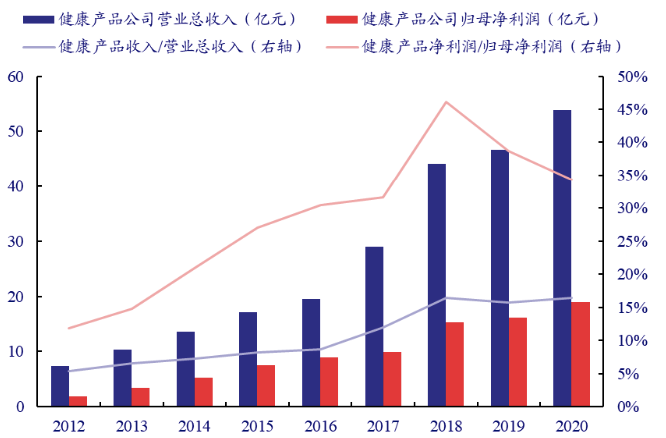
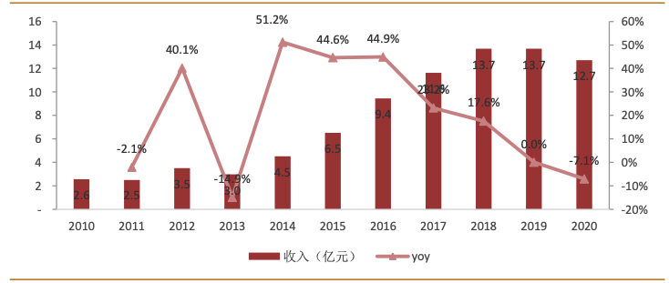
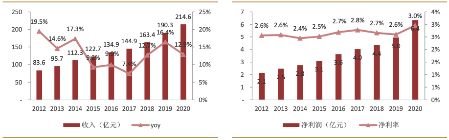
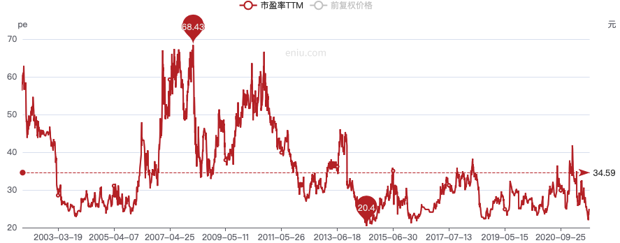
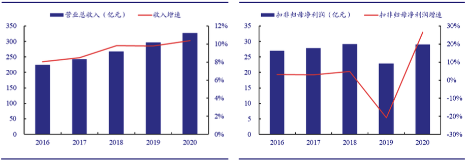

# 每周新股（九）云南白药

云南白药是我国云南省特有的老字号中成药，是经过百年的发展的老品牌，公司历史最早可追溯到1902年，名医曲焕章创立治疗跌打损伤、内脏出血的奇药“百宝丹”，抗战期间“百宝丹”作为军需物资立下奇功，新中国成立后曲焕章夫人将”百宝丹”献给云南省政府，随后被国家将其配方列为国家“绝密”。1993年改制为云南白药实业股份有限公司，在深交所上市。2003年成立健康产品事业部，上市牙膏等日化产品。公司产品已经从百宝丹发展到650余个品种，产品覆盖药品、大健康、医药商业、器械等领域，畅销国内市场及东南亚一带，并逐渐进入日本、欧美等发达国家市场。

自1993年上市以来公司发展主要分为五个阶段，实现多次成功战略转型，建立药品、大健康、中药及商业四大事业部。公司2001年1月市值约33亿元，到2011年1月市值翻十倍到396亿元，再到2021年2月市值达到2000亿元。

- 1993-1998年，云南省4家生产白药的企业合并，云南白药实现对大理制药厂、文 山州制药厂、丽江药业有限公司三家企业进行控股。1996 年确立“五统一”(统一 生 产 计 划 、 统 一 商 标 、 统 一 批 准 文 号 、 统 一 质 量 管 理 、 统 一 销 售 )， 奠 定 了 白 药 的 发展基础。这一阶段公司的主要产品以传统的白药散剂和胶囊为主，收入维持 22.3% 的复合增速。
- 1999-2004年: 引入市场运营机制，王明辉上任总经理，在管理、营销、研发、品 牌四大领域进行改革。建立透皮事业部、健康产品事业部，走出伤科品牌单一领域。 组建电子商务公司，整合省医药公司，构建全国销售网络，营销激励市场化。开拓 胶囊、气雾剂、创可贴等 6 个白药品牌系列产品，收入保持 51.2%的高速增长。
- 2005年初公司确定“稳中央、突两翼”战略，中央即以云南白药系列产品为主，“两 翼”战略即大力发展透皮产品和健康产品。云南白药牙膏是主要利润增长点， 2005-2009 年收入维持复合增速 30.8%的高速增长。
- 2010-2016 年，大力发展大健康事业部，2010 年全面实施“新白药，大健康”战 略，牙膏业务取得重大突破，同时大健康日化板块培育洗护发、卫生巾及护肤新品 牌。这一阶段收入维持 14.3%的增长。
- 2017-2020 年国企混改激发新一轮增长活力，从 2017 年增资扩股引入新华都、鱼 跃科技。完成云南白药集团吸收合并云南白药控股，启动薪酬制度改革、员工持股 以及股权激励机制，极大调动员工的积极性。由于公司面临重大公司调整， 2017-2019 年公司收入维持 10.5% 的复合增速。

## 主营业务

公司目前四大主营业务分别为药品、大健康、医药商业和中药保健，四大板块各自形成差异化定位。

1）明星产品：以云南白药牙膏为代表，具有高市占率和高增长率的特点，产品不断开拓创新，仍然具有较高增长潜力

2）金牛产品：公司传统核心业务药品事业部和医药商业部属于金牛产品业务部门，为公司贡献稳定的利润和现金流来源，具有较高的市场份额，同时奠定白药的品牌基础。

3）成长性产品：品种丰富，主要包括大健康事业部的洗护发用品、卫生巾、面膜以及茶品，这些产品具有较高的业绩弹性增长，且目前市占率较低，未来发展的空间较大。

## 药品

云南白药目前已拥有药品共 19 种剂型，300 余个品种，其中白药系列作为公司主要核心产品，已经由最初的云南白药散剂 拓展至气雾剂、酊、胶囊、膏贴等 6 种类型;普药系列经由 2002 年推出气血康口服液产品 开始，逐渐发展至覆盖多种疾病领域，主要分为感冒类、清热类、妇科类、内分泌系统类、 补益类、胃肠道类、心脑血管类、抗感染类、解热镇痛类、消化类等 12 大类。

2010-2015 年在“新白药、大健康”战略的引领下实现快速增长。2016-2020 年药品事业部受到公司国企混改后一系列重 大战略重组政策的调整收入趋缓，略有下滑趋势。同时在此阶段也面临着去库存的影响，随 着政策落地，去库存负面影响消退，药品事业部有望迎来新一轮复苏。受益于公司核心产品 的品牌及质量优势，除 2015 年外，药品类毛利率保持逐年增长态势，由 2012 年的 32%增 长至 2017 年的 54%。

## 健康产品

健康产品主要分为口腔护理、头皮护理、植物美肌、个人卫生护理四个产品大类。2005年第一支云南白药牙膏上市，树立公司大健康业务标杆。随后，公司分别推出了“养元青”洗护发产品、“采之汲”面膜和“清逸堂”卫生巾。

2006年公司成立健康产品事业部，负责牙膏销售，并以此品牌推进在商超、药店以及流通等渠道的运作。至今公司的健康产品事业部始终保持增长态势。该板块的收入从2010年的10.4亿元增长至2020年的54亿元。其快速发展主要来源于牙膏，2020年牙膏收入为51亿元，占比为95%。养元青洗护系列产品、采之汲美肤系列产品目前处于品牌培育期，收入贡献较少。

## 中药保健

云南省三七产量约占全国 90%以上，云南文山也被称为“中国三七之乡”。2013 年整合文山公司、丽江公司、武定种源公司、中药饮片分公司，成立中药资源事业部。公司充分利用云南地道天然植 物药材的资源优势，从中药资源源头入手，建立中药资源完整产业链，建立了武定、丽江等重楼基地 10000 多亩及通过国家 GAP 认证的文山三七种植基地 5000 亩。近年来中药事业部收入呈逐年上升趋势，业务成长性高。公司中药资源收入从 2010 年的 2.6 亿增长到 2019 年的 13.7 亿，实现复合增长率 20%。2020 年收入为 12.7 亿元，受到疫情影响有所下降。

三七系列保健品主要有超细粉产品、冻干三七切片以及主根产品系列。我国三七产 量自 2017 年开始逐年增加，目前三七种植业年产值约 55 亿元，销售收入约 50 亿元。目前 我国有 400 多个品种、1000 多家药厂需要以三七为原料，国内需求量超过 2 万吨;2019 年 总产量超过 3.5 万吨，种植业销售收入达 47.7 亿元，加工业销售收入达 13.4 亿元，流通业 销售收入约 74.1 亿元。

公司目前整合基地建设资源，全面启动“滇重楼同心计划”， 实现从种苗到药材回收全程追溯的闭环生产模式，保障重楼药材的长期供应体系。自 2015 年来产品开发以“三高”防治为主线的理念，以三七为核心，结合天麻、丹参等形成系列精 品中药饮品产品。

## 医药商业

公司医药商业业务始于 1999 年，以药品批发业务为主，通过全资子公司“云南省医药 有限公司”来开展。1999 年，云南省医药公司配股进入云南白药集团，成为集团的四大板块之一，营收占比稳定在 60%左右，拥有常年动销品种近 6000 个，以品牌品种和医疗器械 为主导，拥有新药品、特殊药品、专科药等品种优势。2020 年销售额达 214.6 亿元，同比增长 13%，毛利率持续提升，2020 年毛利率提升至 3%。

## 估值情况

从历史市盈率看，在11年以前市场给予的估值比较高，11年以后估值基本都在40以下。目前公司市盈率25倍PE，不算很贵但是也不便宜。

值得注意的是，虽然公司近几年净利润增长迅速，但是净利润与扣非净利润差距较大。2020年净利润55亿，扣非净利润28.9亿，两者相差较大是因为公司投资股票带来的非经常性收益较大。单看扣非净利润的增速，公司2016年-2020年基本停滞增长。目前，公司的业务中贡献利润的主要是健康产品，医药商业，药品，三个板块缺乏确定的成长点，因此，从初步分析来看，只能将云南白药归为价值型标的一类。对于一个价值型的标的，只有当其市盈率低于20时才会考虑建仓，当然，本次只是初步分析，后续深入分析如果能发现较好的成长点，会重新调整建仓条件。

